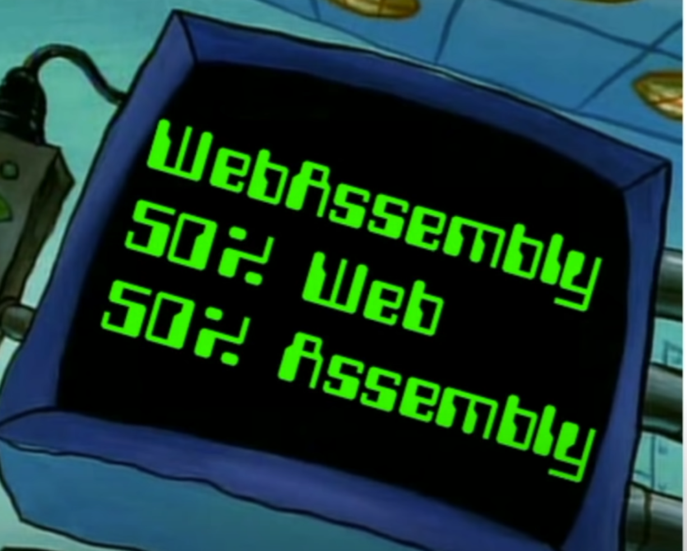
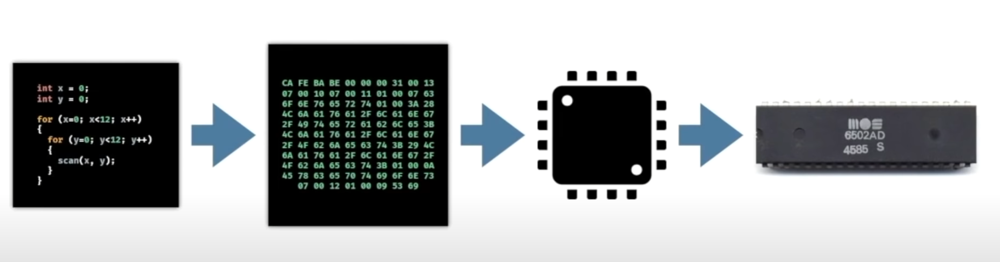
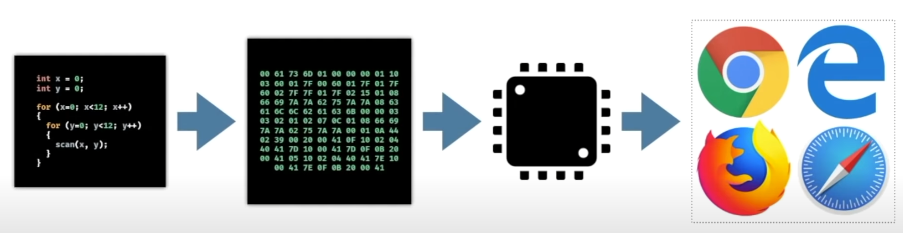
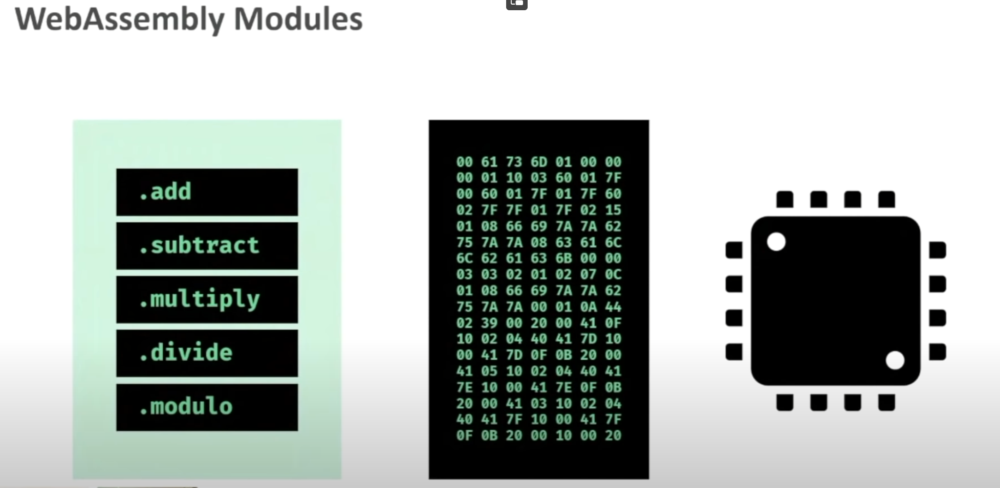
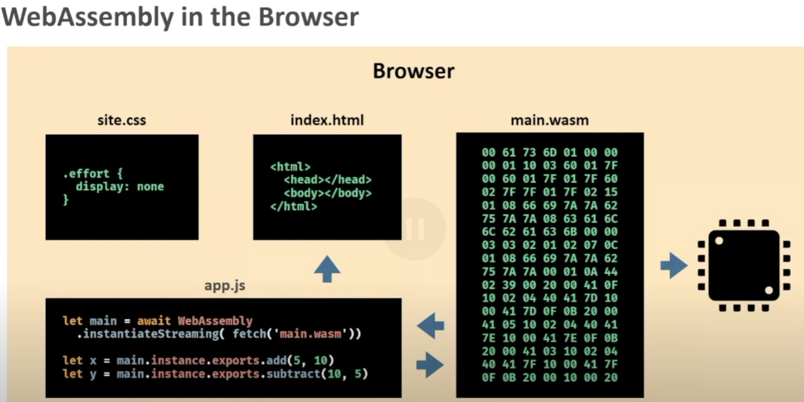
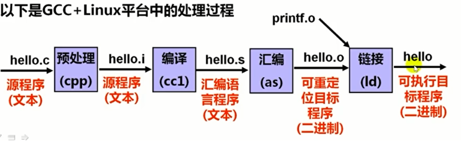

### some abbreviations:

dapp: decentralized application (can be full-stack)  
IC: internet computer  
dfx: developer experience, the IC-SDK name  
Candid: an interface description language (IDL),a tool developed by DFINITY that allows different programs to communicate with each other on the Internet Computer.(Candid” does not appear to be an acronym or abbreviation, hah)  

#### some interesting fact:

HCI: human–computer interaction  
GUI: colorful ,with buttons and images,  
CLI: only text input and ouput  
normally call GUI as frontend.  
but Graphical User Interface by its\` name is not quite accurate diff with CLI. CLI could also be a kind of Graphical User Interface,use text to represent pictures,hah.  

```
  (\(\
  ( -.-)
  o_(")(")

```

In theory, any language that can be compiled into a WebAssembly module, can produce modules tailored for the IC deployable as an ICP smart contract.  

## install dfx

```sh
sh -ci "$(curl -fsSL https://internetcomputer.org/install.sh)"
# or:(if encounter net problem)
wget https://github.com/dfinity/sdk/releases/download/0.14.3/dfx-0.14.3-x86_64-linux.tar.gz

# mention the dfx version,maybe you should use latest.
# v0.14.3 just for 2023-7


```

## IC-canister running tutorial:

```sh
dfx new hello # create a example project "hello"
cd hello
dfx start --background

# deploy:
npm install # install all dependencies locally
dfx deploy #start backend and frontend program

#testing:
dfx canister call hello_backend greet everyone
# greet -> backend_controller_name
# everyone -> the param to send with that controller(function on the server)
# receive from the terminal output:
# ("Hello, everyone!")

#stop:
dfx stop
```

## How to use other backend language ?

By default backend use Mokoto.  
How to use rust (with webMVC) ?  
Or even Java , Python?  
todo  
Some IC-rust maybe:
https://github.com/usergeek/canistergeek_ic_rust  
IC-app-flutter:
https://github.com/AstroxNetwork/agent_dart  

## Deploy dapp on IC-chain(on the Internet)

todo  

## IC compile all codes into WASM

### WebAssembly intro:

content from: https://youtu.be/3sU557ZKjUs  
WASM:
1.assembly language for web browser  
  
2.A solution to a problem:
problem is JS:
JS running on browser steps:
  
带来的问题就是运行速度太慢  

wasm 是一个运行在 browser 里面的 VM  
这个 VM 运行 bytecode(assembly)  

利用这个特性,可以编译任何语言为 assembly!  

原生的 asm 代码是 architecture-specific  
因此 computer scientist 发明了 virtual-processor  
分离了原生 asm 和 phsical-processor  
最终使得 v-asm 可以运行于任何的 cpu 上面!  
  
  
这里是一个.wasm 文件,包含了一堆可以拿来用的函数  
有点像.dll 文件  
  
  

.wat 文件是对应像.S (汇编代码) 文件,有助记符  
.wasm 则是纯二进制直接可以运行在 VM 上面的文件  
使用 wat2wasm 则转译,作用像是 as 汇编器  
使用 wasmtime 可以在命令行运行 wasm 文件,像是 js 的 runtime:如 nodejs  
WASI:WebAssembly System Interface, 提供系统级别的 IO  

### 编译过程:

c++/rust -> wat -> wasm  
对比理解:
  
