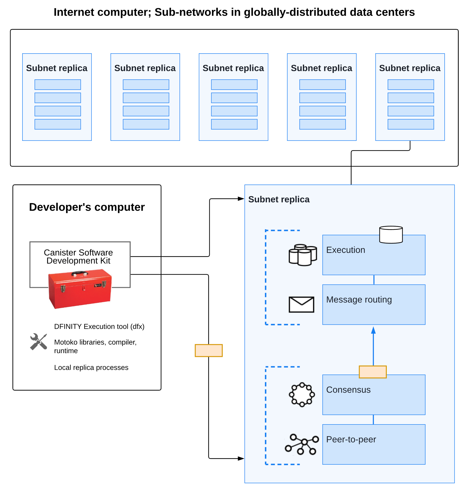
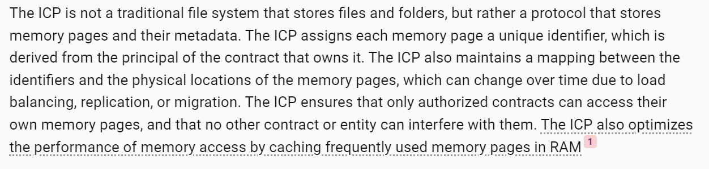
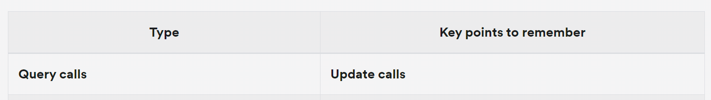
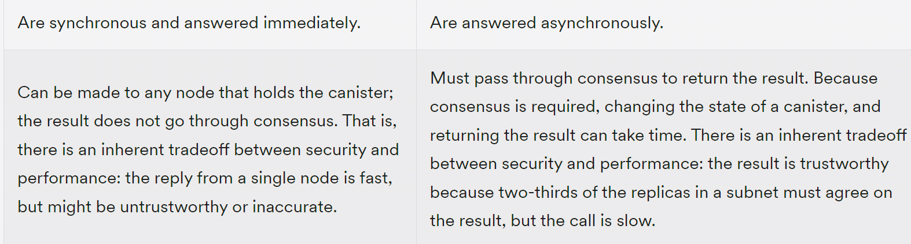

# 首先有一个 IC 的区块链

构建主区块链(mainnet)是由多个 subnet 组成的.  
Goverance System 会自动扩展或者收缩 dapp 所需要的计算和存储资源  

# 然后区块链上面有容器:canister

container:通用意义上的容器,可以方便地部署和开发,  
canister: 包含状态的罐子,这里指可以存储一些数据,不只是函数\

# 容器包括 2 个部分:函数和存储

(计算)函数由高级语言生成的 WASM 代码 提供给调用者  
(存储)使用计算机内存和持久化存储(如 SSD 或者 HDD),抽象为 IC 专有的存储结构,称为: memory pages  
但是这里的持久化存储是分布式的,基于 IC-Protocol  

# 与 canister 交互: 两种接口:query update

Non-committing query calls (any state change is discarded).  
Committing update calls (state changes are persisted).  
同步,异步  
  
任意就近节点查询,遍历所有节点修改  

# 把 canister 部署到 IC-chain 上的过程:

**canister 会到 chain 上去注册(Authentication)自己,形成 canister 自己的身份(Identity)**,  
形成一个自己的公钥字符串,被称作 Principle
