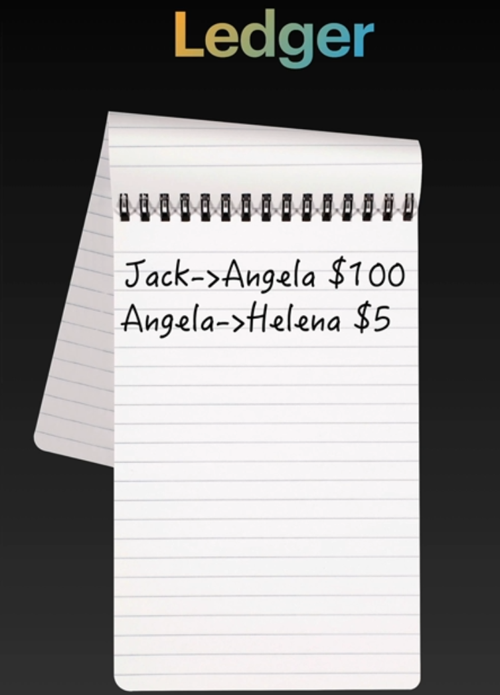
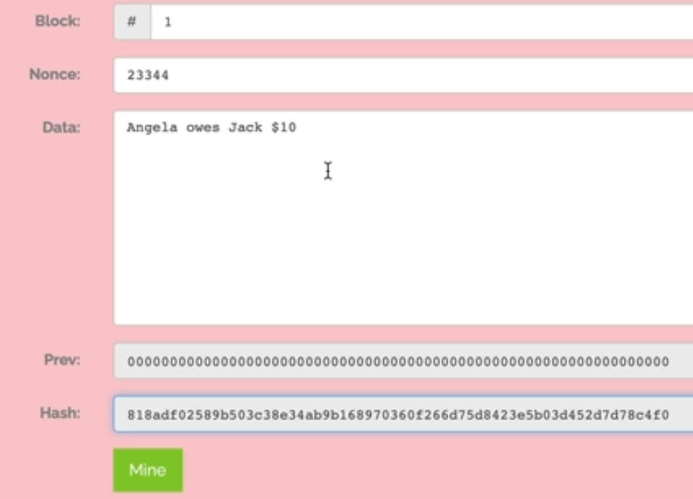
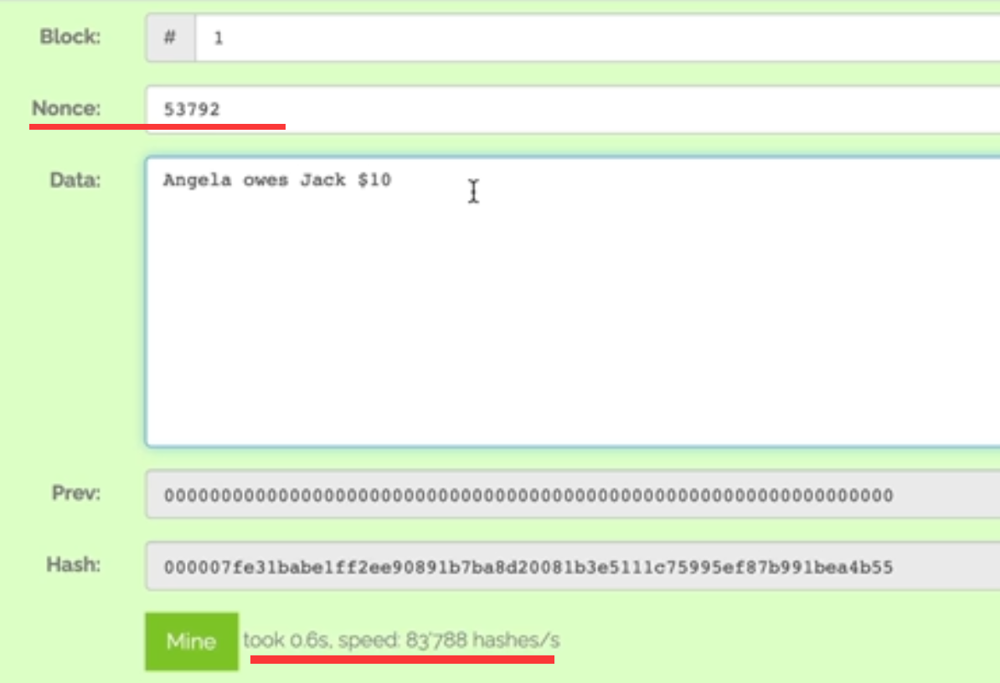
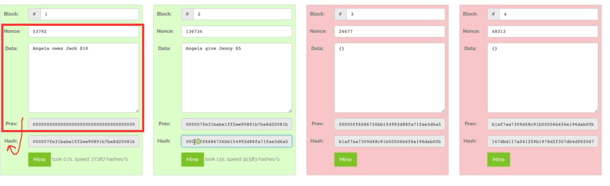
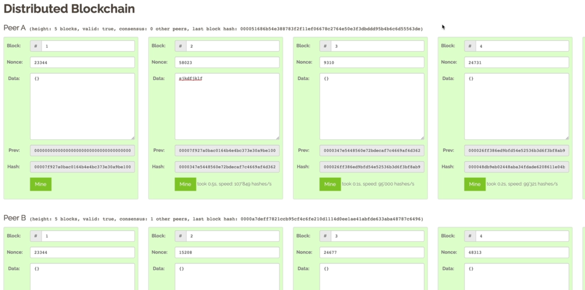
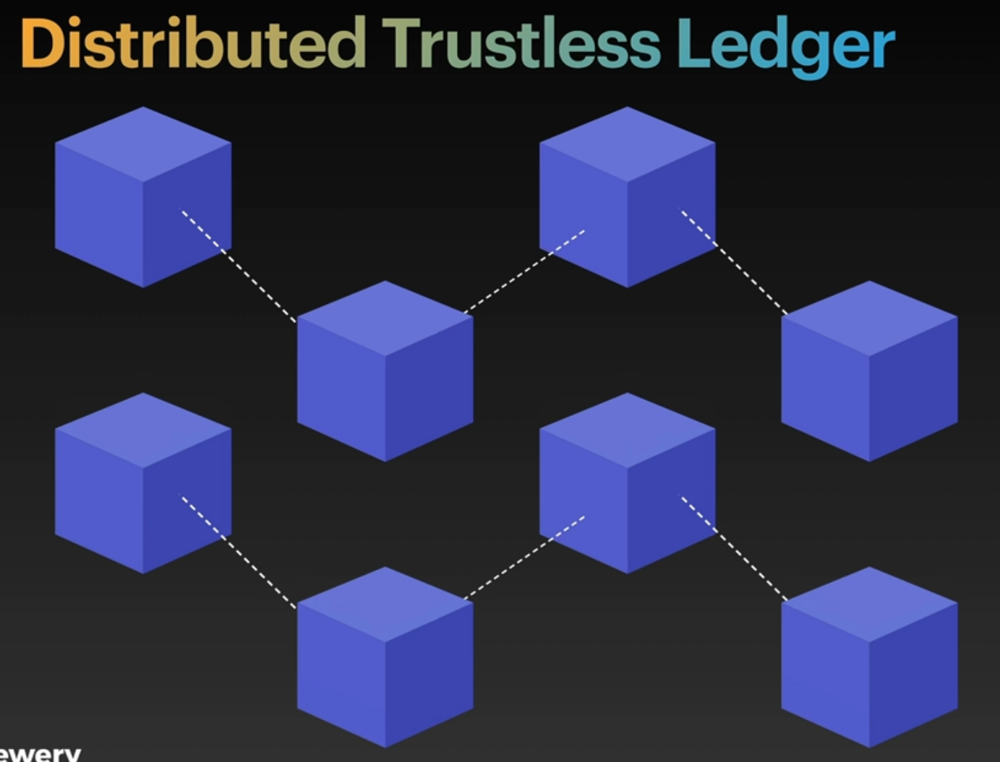
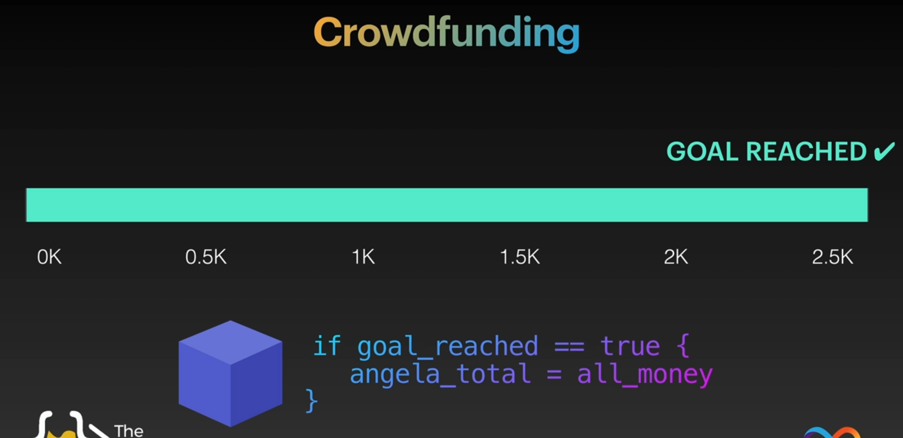
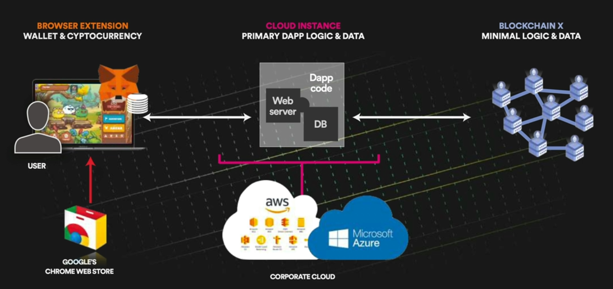

content ref: https://www.udemy.com/course/the-complete-web-development-bootcamp/
### names:  
ledger: 账本  
cipher: 加密过后的密文 decipher:解密  

# design goal
## unbreakble promise
## data transfer:
1. use RSA encryption.  
public key for **transfer** permit  
private key for **deencrytion** data.  

### encryt methods:
Hash:  SHA-256 Cryptographic Hash Algorithm  
This method is like:  
encrypt **forward**: 将1024个01比特,把每个8bit识别为一个数字,然后将他们每个数字相乘,得到那个hash值.   
如  35*21*75*49=2701125  
deencrypt **backward**: 求解256位数的公因子   
find 2 factor number of 40 digits  take 900 years of computer computation.      
几乎不可能从2701125得到这四个factor: 35*21*75*49  

# block
example:

mine:

Q: why need nonce?? 
A: maybe for increase difficuty?

# blockchian:

calcute with nonce and data and prev to get **hash**

# distributed blockchain:

simply just copy-paste each chain.  
they are exactly the same .  
if someone change data on onchain and remining it . others will find the hash is diff, so that chain is cheat.  

# breckthrough: store code in the block: Ethereum
they find that we can **store code in the block**.
so code is immutable.

a code snippet colecect money ,and auto distribute money to xxx when goal is get.

# web3 history:
not fully decentralized yet:
benefit of fully decentralized:
1. unbreakable promise.
2. no one can shutdown machine just one finger.

why not fully decentralized yet:
1. CRUD speed. performance. efficiency